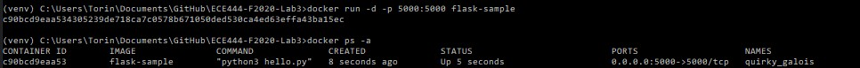
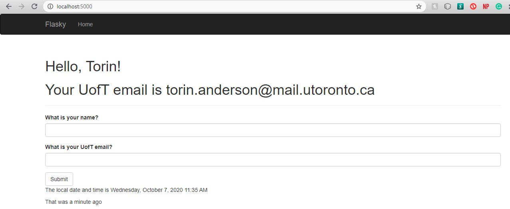
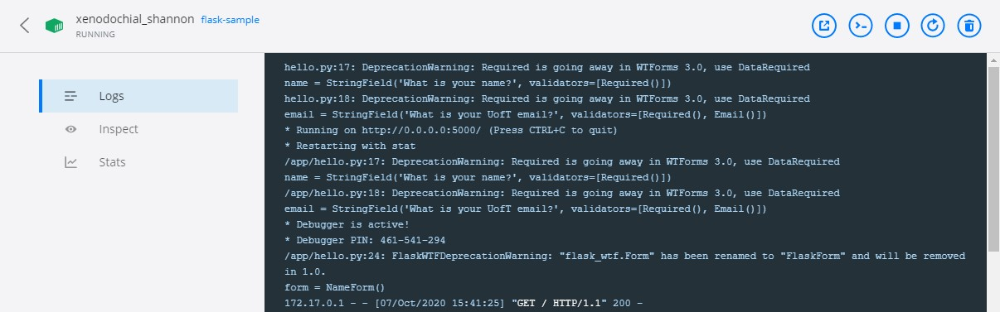

# Torin Anderson

this repo is a clone of
https://github.com/miguelgrinberg/flasky with added dockerization

# Starting the System

# Browser Output

# Logs

# How to build
To build the docker image, simply run the following terminal command from within the main workspace folder (ECE444-F2020-Lab3): "docker build -t flask-sample:latest ."

Then to run the container, use the following command: "docker run -d -p 5000:5000 flask-sample" Then you can go to localhost:5000 to see the webpage.

On my Windows machine, the image file is located at "C:\Users\Torin\AppData\Local\Docker\wsl\data"

# Difference between Docker container and Virtual Machine
A Docker container runs as any other lightweight program, not utilizing any more memory on the host machine than it needs. A virtual machine on the other hand will take up a set amount of memory and hard drive space in order to function. This is so that it can better emulate the simulated operating system and allow users to utilize the full extent of the virtualized OS. As such, VMs have more overhead than containers and will thus be both slower and more memory intensive.

