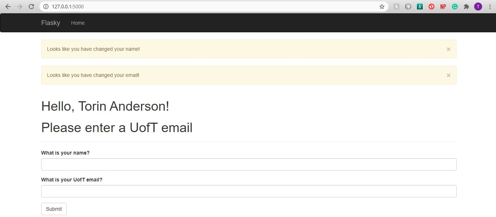

# Torin Anderson

this repo is a clone of
https://github.com/miguelgrinberg/flasky

# Activity 1 Screenshot

# Activity 2 Screenshots

# Activity 3 Answer
SQL databases allow for relationships between rows from the same or different tables. This means that if the name of an item in a table changes, this change will not impact other table items that reference it. SQL databases give rows a primary key which acts as their main identifier, but they can also contain foreign keys that act as the link between the row and other rows. NoSQL databases differ in that they have collections instead of table and documents instead of records. These databases were not built with relationships in mind, as such the process to reference other rows is too difficult. But this makes it more efficient for entries which do not reference eachother, or denormalizednormalized collections which contain all of the information about an entry within the document without referencing other entries.